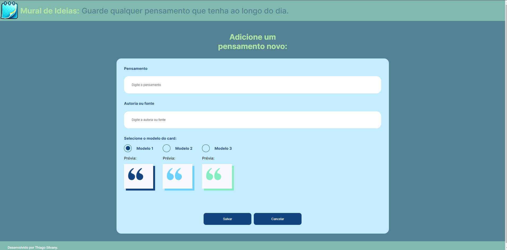

# Mural de Ideias

O Mural de Ideias é uma aplicação web desenvolvida para permitir aos usuários capturar, organizar e compartilhar suas ideias de forma intuitiva e visualmente atraente. O projeto utiliza Angular no frontend para uma experiência de usuário responsiva e moderna, e json-server para uma simulação de backend que maneja as operações CRUD (criar, ler, atualizar, deletar) de forma eficiente. Ideal para criativos, profissionais e estudantes que desejam manter um registro organizado de suas ideias e inspirações.

---

## Pré-requisitos

Antes de iniciar, você precisará ter instalado no seu computador:
- Node.js
- npm (Node Package Manager)
- Angular CLI
- json-server
---

## Instalação

### Node.js e npm

Instale o Node.js e npm, que é o gerenciador de pacotes do Node, a partir do [site oficial do Node.js](https://nodejs.org/).
---

### Angular CLI

Com o Node.js e npm instalados, execute o seguinte comando no terminal para instalar o Angular CLI globalmente:

```bash
npm install -g @angular/cli
```
---

json-server
Instale o json-server globalmente usando npm com o seguinte comando:
```bash
npm install -g json-server
```
---

Configuração do Projeto
Clone o repositório

```bash
git clone https://link-para-o-seu-repositorio.git
cd nome-do-seu-repositorio
```
---

Instale as dependências

Dentro do diretório do projeto, execute:

```bash
npm install
Inicie o json-server
```
---

Navegue até a pasta backend e inicie o servidor usando:

```bash
cd backend
npm start
```
Isso iniciará o json-server na porta configurada, normalmente 3000.

---

Inicie o projeto Angular

Em um novo terminal, navegue de volta ao diretório raiz do projeto e inicie o servidor de desenvolvimento do Angular:

```bash
Copiar código
ng serve
Por padrão, a aplicação estará acessível em http://localhost:4200.
```
---

Prints da Tela

Aqui temos a pagina principal onde você vai encontrar alguns pensamentos ja salvos, um botão que ao ser clicado vai para a pagina de adicionar novo pensamento. É nela que você verá suas ideias salvas podendo excluilas ou editalas.


 
---
Aqui temos a pagina de cadastro de uma nova ideia onde você digitará sua ideia, a autoria e o modelo de como ele vai ser salvo.



---

Uso
Após iniciar o servidor Angular e o json-server, você pode acessar a aplicação pelo navegador em http://localhost:4200. Use a aplicação para criar, editar, deletar e categorizar ideias conforme necessário.


